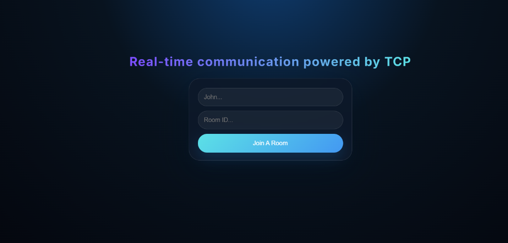
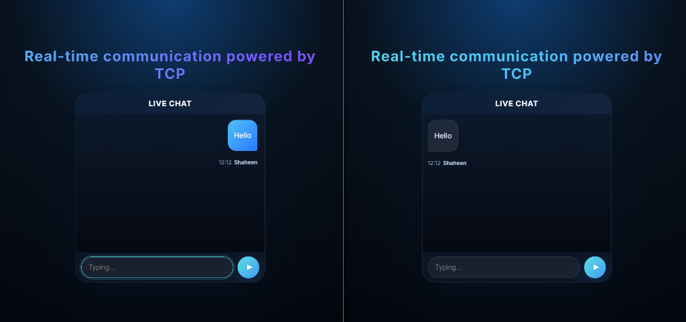
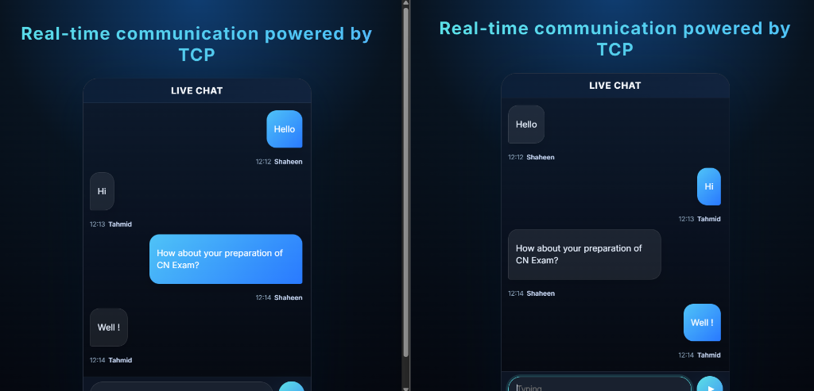

# 🚀 Modern Real-Time Chat Application

## 🌐 Real-time communication powered by TCP



A high-performance, real-time messaging application built with **React**, **Socket.io**, and **MongoDB**. This project features a premium UI/UX design with smooth animations, glassmorphism, and a robust backend.

---

## 🖼️ Project Gallery

| Chat View 1 | Chat View 2 |
|:---:|:---:|
|  |  |

---

## ✨ UI/UX Highlights

- **Dynamic Animations**: The application features a stunning shimmering headline and smooth "fade-in-up" transitions for messages and containers.
- **Premium Glassmorphism**: Uses modern backdrop-blur effects and subtle gradients to create a high-end, futuristic feel.
- **Clean & Compact Layout**: Optimized message spacing and slimmed-down components for a focused and productive chatting experience.
- **Responsive Design**: Works beautifully across different screen sizes, ensuring a consistent experience on mobile and desktop.
- **Dark Mode Aesthetic**: A curated dark-themed palette with vibrant primary and accent colors for better readability and style.

---

## 🛠️ Tech Stack

- **Frontend**: React.js, CSS3 (Vanilla), Socket.io-client
- **Backend**: Node.js, Express, Socket.io
- **Database**: MongoDB (Native Driver)
- **Real-Time**: WebSockets for instantaneous messaging

---

## 🚀 Key Features

- **Real-Time Messaging**: Send and receive messages instantly without page refreshes.
- **Room System**: Join specific chat rooms to keep conversations organized.
- **Persistent History**: All messages are saved in MongoDB and reloaded automatically when you join a room.
- **Seamless Connectivity**: Auto-reconnects and handles database connection issues gracefully.

---

## 📦 Installation & Setup

### 1. Prerequisites
- [Node.js](https://nodejs.org/) installed
- [MongoDB](https://www.mongodb.com/try/download/community) installed and running locally

### 2. Backend Setup
```bash
cd server
npm install
# Create a .env file and add your MONGO_URI
node index.js
```

### 3. Frontend Setup
```bash
cd client
npm install
npm start
```

---

## 📸 Screenshots
*(Add your screenshots here to show off the beautiful UI!)*

---

## 📄 License
This project is open-source and available for everyone.

---

*Made with ❤️ for a better chatting experience.*
